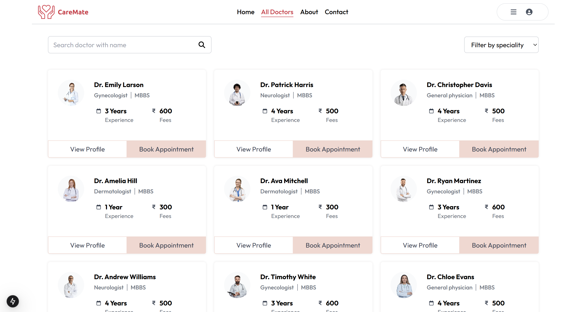
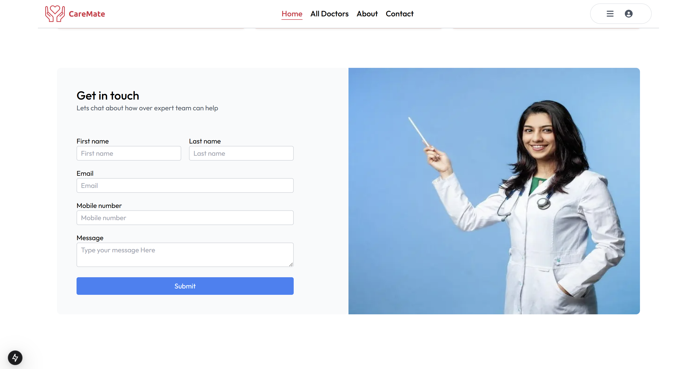
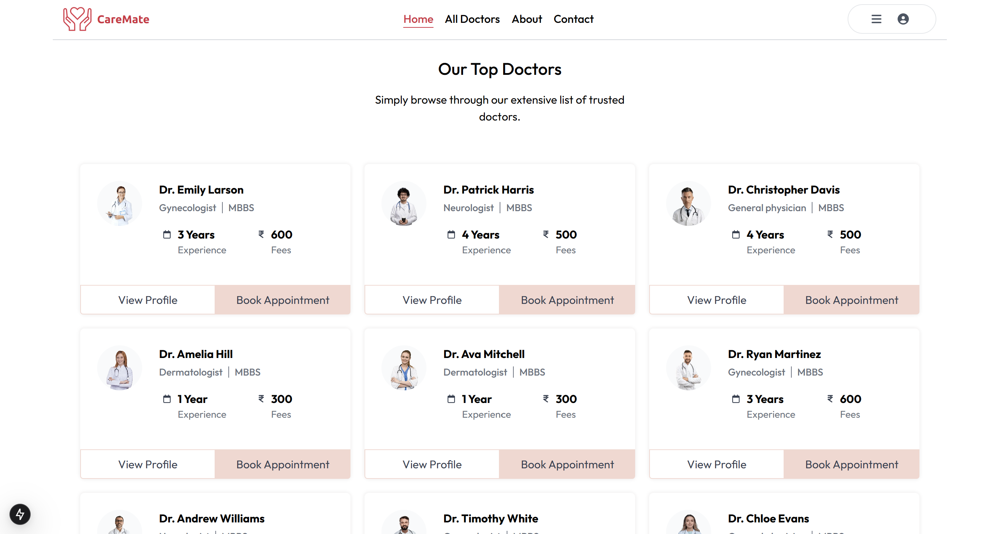
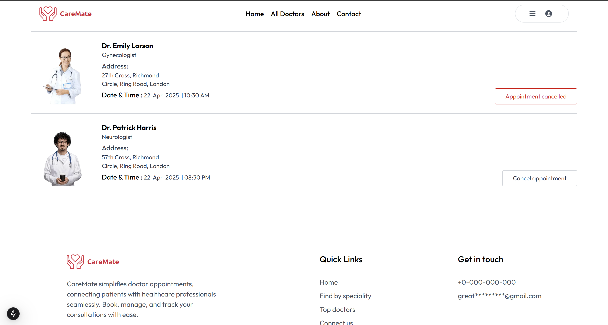

## 🔗 Vercel Link
[https://care-mate.vercel.app/](https://care-mate.vercel.app/)  


## 🩺 CareMate

This is an appointment booking application where users can securely login and book and cancel appointments with their required speciality doctors.

## ✨ Features

- 🔐 Secure Google login & signup
- 📅 Book and cancel appointments
- 🧑‍⚕️ Filter doctors by speciality
- 📂 View your appointment history
- 🌐 Fully responsive UI


## Getting started to run local dev server 

Clone the project

```bash
git clone https://github.com/info2suniljangir/CareMate.git

```

Install dependencies
```bash
npm install
```

Run the development server;

```bash
npm run dev
# or
yarn dev
# or
pnpm dev
# or
bun dev
```


Open [http://localhost:3000](http://localhost:3000) with your browser to see the result.


## 🧰 Tech Stack

**Frontend:** Next.js, React.js, TailwindCSS  
**Backend:** Next.js API Routes, Server Actions  
**Database:** Neon PostgreSQL  
**Image Hosting:** Cloudinary  
**Deployment:** Vercel 

## Short guideline for using application

Step1: Signup as a new user or login with Google.  
Step2: Open All Doctors tab from navbar.  
Step3: Click book appointment on the doctors card.  
Step4: Select a date and slot and then hit appointment button.  
Step5: to see all appointment open dropdown menu and then hit my appointment option.  

## Screenshots

### 🏠 Homepage





## All Doctors Page


## Book Appointment Page


## My appointment page



## Author
Sunil Kumar Jangir  
Frontend developer in progress | Passionate about building useful application.  
Sikar, Rajasthan, India  
Github [https://github.com/info2suniljangir](https://github.com/info2suniljangir)  
Linkedin [https://www.linkedin.com/in/info2suniljangir]  
Email: info2suniljangir@gmail.com  

Developed and maintained by Sunil Kumar Jangir, a self-driven developer passionate about creating meaningful web applications.


## Thank you

Thanks for visiting and checking out CareMate!

